# Roostr – MERN Room Booking Platform 🐓🏡


Roostr is a full-stack **Airbnb-style room booking platform** built with the **MERN stack**.  
Guests can search and reserve stays, while hosts can create listings, manage availability & pricing, and view booking analytics in a host dashboard.

This project is part of my portfolio as a **3rd-year Software Engineering undergraduate at SLIIT**, showcasing both frontend (React/Tailwind) and backend (Node/Express/MongoDB) development skills.

---
## 🎨 Design Inspiration

Roostr’s UI is **inspired by Airbnb’s product design** – especially the layout of the home screen, room details page, and booking flow.  
All components, code, and assets in this project were implemented by me from scratch, using Airbnb only as a visual reference, not as a source of code.

I also used **Figma** to sketch and refine most of the screens before building them in React.  
I enjoy playing with UI ideas in Figma first (spacing, colors, typography, components) and then turning those designs into working interfaces with React and Tailwind CSS.

*All layouts and components were recreated by me for learning purposes, and I designed the screens in Figma before implementing them with React and Tailwind.*
https://www.figma.com/design/GSkaUyjHk4TIFkMhdQri7v/Roostr-Website?node-id=0-1&t=8yTHahoXjhXnvRqr-1

---

## 🧾 Table of Contents

- [Features](#-features)
  - [Guest Experience](#guest-experience)
  - [Host Experience](#host-experience)
  - [Booking & Payment Flow](#booking--payment-flow)
  - [Authentication & Security](#authentication--security)
- [Tech Stack](#-tech-stack)
- [Project Structure](#-project-structure)
- [Environment Variables](#-environment-variables)
- [Running the Project](#-running-the-project)
- [Screenshots](#-screenshots)
- [Future Improvements](#-future-improvements)
- [About the Developer](#-about-the-developer)

---

## ✨ Features

### Guest Experience

- **Home screen with curated listings**
  - Clean, Airbnb-inspired layout for browsing rooms.
  - Displays title, location, price per night and quick details.
  - Uses reusable cards powered by data from the backend.

- **Search & filtering**
  - Search by **destination**, **check-in / check-out** dates and **number of guests**.
  - Search context is shared across pages via a global `SearchContext`.
  - Search results respect real availability using booking data from MongoDB.

- **Room details page**
  - Large hero image + additional gallery images on the right.
  - Dynamic header built from backend data:
    - Property type, city & country.
    - Guest capacity, beds and baths.
  - Detailed **description** text pulled from the room document.
  - Amenity icons & grouping:
    - “What this place offers” shows the most important amenities with icons.
    - “Show all amenities” opens a full-screen modal grouped by category
      (Bathroom, Bedroom & laundry, Kitchen & dining, Entertainment, etc.).
  - Static review and rating section styled to match the Airbnb feeling.

- **Guest selector**
  - Dropdown for **adults, children, infants and pets**.
  - Live count with nice UX (plus/minus buttons).
  - Generates a human-readable summary like  
    `2 guests, 1 infant, 1 pet`.

---

### Host Experience

- **Become a host**
  - Authenticated users can switch into host mode and access host-only features.
  - Host-only routes are protected on the backend using JWT and middleware.

- **Add new room listing**
  - Multi-step form that stores data in MongoDB:
    - Basic info: title, headline, property type, city, country.
    - Capacity: guests, beds, baths.
    - Highlights (self check-in, free parking, superhost, outdoor features).
    - Detailed description & “Meet your host” section.
    - Amenities grouped by category.
    - Pricing and base nightly rate.
    - Cover image + gallery images (uploaded to Cloudinary or local storage).

- **Room editing**
  - Edit room details (title, description, pricing, etc.).
  - Edit amenities and highlights to match real-world changes.

- **Host dashboard & analytics**
  - Dedicated `/host/dashboard` page showing:
    - Total bookings, total revenue, and occupancy stats.
    - **Charts** (bar and line) to show booking & revenue trends.
    - Table with room-level metrics.
  - Data is calculated in the backend via `hostAnalyticsController`.

- **Past bookings view**
  - Hosts can view their previous bookings, dates and guests information.
  - Useful for tracking performance and repeat guests.

---

### Booking & Payment Flow

- **Availability calendar (per room)**
  - Custom calendar component on `RoomDetails`:
    - Loads existing bookings for that room from the backend.
    - Blocks already booked nights and prevents overlapping ranges.
    - Only allows valid `check-in < check-out` combinations.
  - “Reserve” button becomes active only when:
    - Both dates are selected, **and**
    - The full date range is available.

- **Price calculation**
  - Nightly price is taken from the room document (with fallbacks).
  - Total nights = difference between check-in and check-out (using Day.js).
  - `totalPrice = nights × pricePerNight`, displayed before payment.

- **Payment page (3-step flow)**
  - Step 1: **Add payment**
    - Fake credit-card form (for demo) – no real gateway.
    - Booking summary card with dates, nights, and total price.
  - Step 2: **Write message**
    - Optional message from guest to host.
  - Step 3: **Review request**
    - Final confirmation of dates, guests and price before booking is created.
  - After confirmation a booking document is created in MongoDB.

- **Finish booking page & receipt**
  - `FinishBooking` page shows:
    - Thank-you message.
    - Unique reservation code.
    - Final trip summary (dates, guests, room image).
  - Automatic **PDF receipt / ticket** generation (sample:
    `Screenshots/Roostr_Receipt_5699338.pdf`).

---

### Authentication & Security

- **JWT authentication**
  - Register & login endpoints return signed JWTs.
  - Protected routes validate tokens via Express middleware.

- **Role-based authorization**
  - Different permissions for **guest** vs **host** actions.
  - Host-only access for:
    - Adding/editing rooms,
    - Viewing host analytics,
    - Managing availability & pricing.

---

## 🛠 Tech Stack

**Frontend**

- React (functional components + hooks)
- React Router v6
- Context API for auth & search state
- Tailwind CSS
- Axios
- Day.js

**Backend**

- Node.js + Express
- MongoDB + Mongoose
- JSON Web Tokens (JWT)
- Multer + Cloudinary (or local uploads) for image handling

---

## 📂 Project Structure

> High-level overview (actual files may include more components and utilities).

```text
roostr-mern-booking-platform/
├── backend/
│   ├── config/
│   │   ├── cloudinary.js
│   │   └── db.js
│   ├── controllers/
│   │   ├── authController.js
│   │   ├── bookingController.js
│   │   ├── hostAnalyticsController.js
│   │   ├── roomController.js
│   │   ├── roomMetaController.js
│   │   ├── searchController.js
│   │   └── userController.js
│   ├── middleware/
│   │   ├── auth.js
│   │   └── authMiddleware.js
│   ├── models/
│   │   ├── Booking.js
│   │   ├── Room.js
│   │   ├── RoomMeta.js
│   │   └── User.js
│   ├── routes/
│   │   ├── authRoutes.js
│   │   ├── bookingRoutes.js
│   │   ├── hostAnalyticsRoutes.js
│   │   ├── roomMetaRoutes.js
│   │   ├── roomRoutes.js
│   │   ├── searchRoutes.js
│   │   └── userRoutes.js
│   ├── server.js
│   └── package.json
│
├── src/
│   ├── assets/              # Logos, icons, room images
│   ├── components/          # Navbars, Calendar, Modals, Cards, etc.
│   ├── context/
│   │   ├── AuthContext.jsx
│   │   └── SearchContext.jsx
│   ├── pages/
│   │   ├── HomeScreen.jsx
│   │   ├── RoomDetails.jsx
│   │   ├── PaymentPage.jsx
│   │   ├── FinishBooking.jsx
│   │   ├── HostDashboard.jsx
│   │   ├── AddNewRoom.jsx
│   │   ├── BecomeHost.jsx
│   │   ├── Profile.jsx
│   │   ├── Signup.jsx
│   │   └── Login.jsx
│   ├── App.js
│   └── index.js
│
├── Screenshots/
│   ├── Home-Screenpng.png
│   ├── Room-Details.png
│   ├── roomdetails-edit-1.png
│   ├── roomdetails-edit-2.png
│   ├── booking1.png
│   ├── Payment1.png
│   ├── Payment2.png
│   ├── Payment3.png
│   ├── Payment4.png
│   ├── dashboard-1.png
│   ├── dashboard-2.png
│   ├── past-bookings.png
│   ├── Search1.png
│   ├── Search2.png
│   ├── Search3.png
│   ├── menu.png
│   ├── logout.png
│   └── Roostr_Receipt_5699338.pdf
│
├── package.json
├── README.md
└── ...
```
## Backend – backend/.env
````
PORT=5000
MONGO_URI=your_mongodb_connection_string

JWT_SECRET=your_super_secret_key

CLOUDINARY_CLOUD_NAME=your_cloud_name
CLOUDINARY_API_KEY=your_cloudinary_key
CLOUDINARY_API_SECRET=your_cloudinary_secret

-CLIENT_URL=http://localhost:3000

````

## Frontend – .env at project root
```
REACT_APP_API_URL=http://localhost:5000
```

## 🚀 Running the Project

**1. Clone the repository**
```
git clone https://github.com/SithumBuddhika/roostr-mern-booking-platform.git
cd roostr-mern-booking-platform

```
**2. Install dependencies**
```
cd backend
npm install
```

**3. Configure environment**
  -Create .env files for both backend and frontend using the examples above.

**4. Start the backend server**
````
cd ..
npm start
# App: http://localhost:3000
````

## 🖼 Screenshots

**Home & Search**
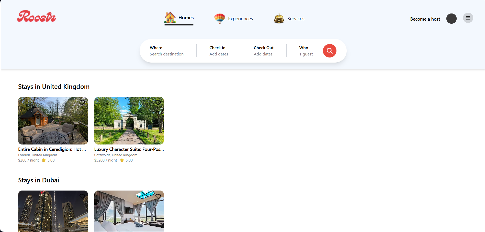
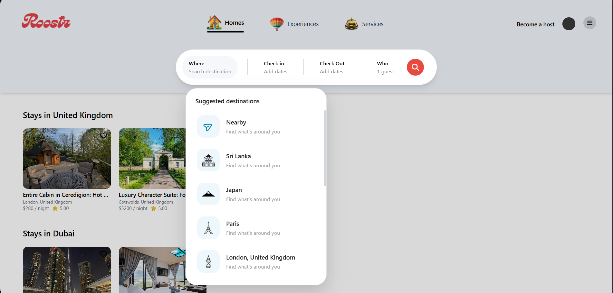
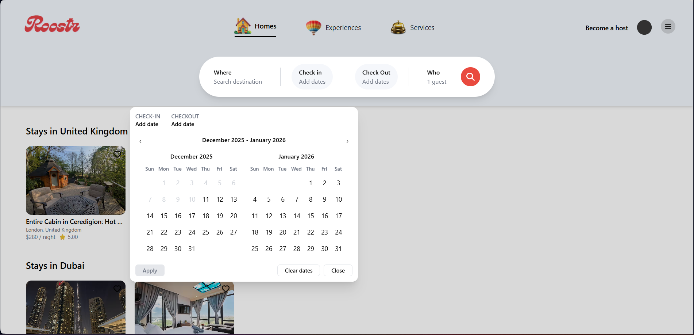
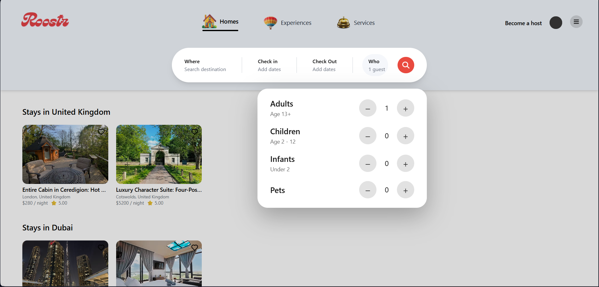

**Room Details & Editing**
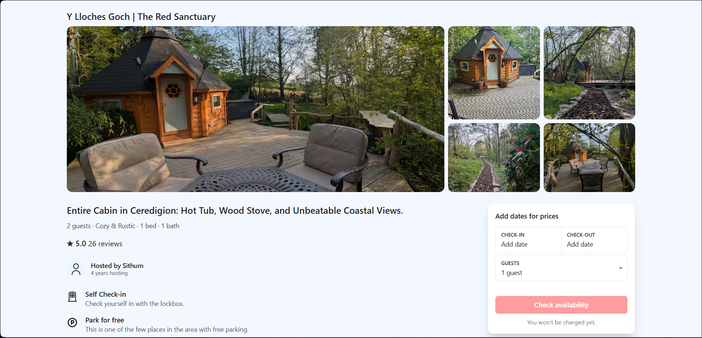


**Booking & Payment**
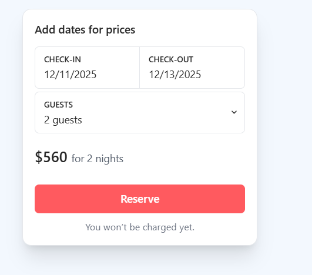

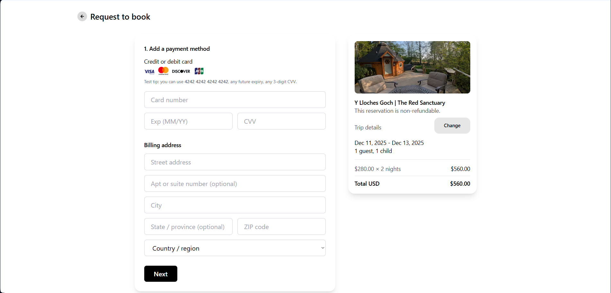
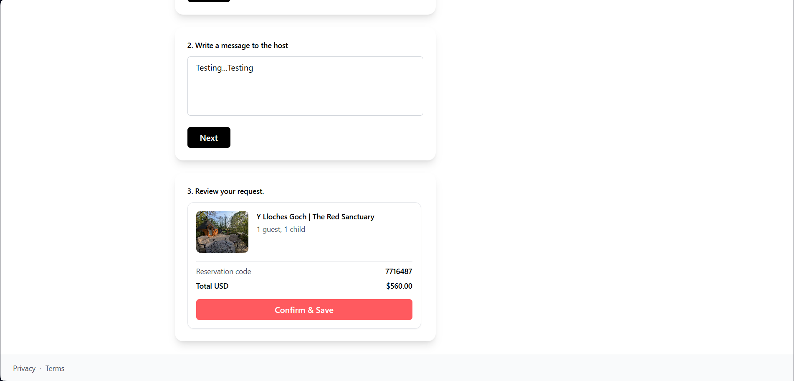

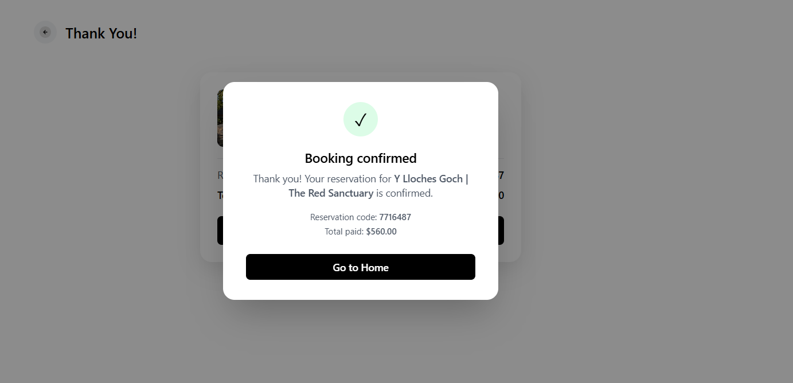

**Host Dashboard**
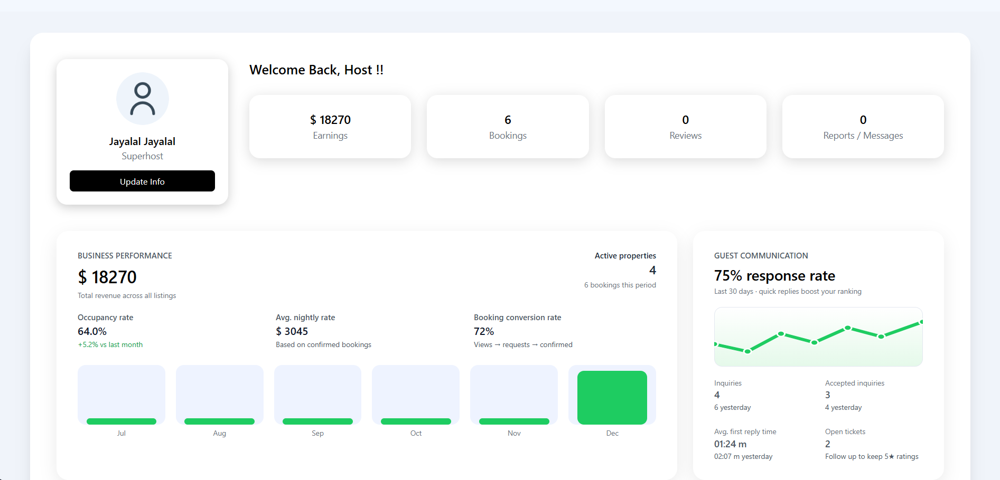
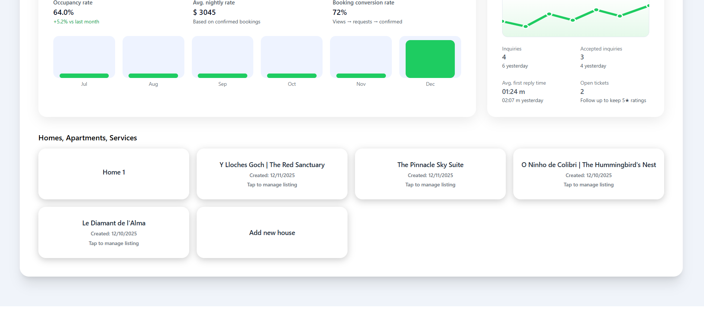

**Host Dashboard + Manage Room/Pricing**
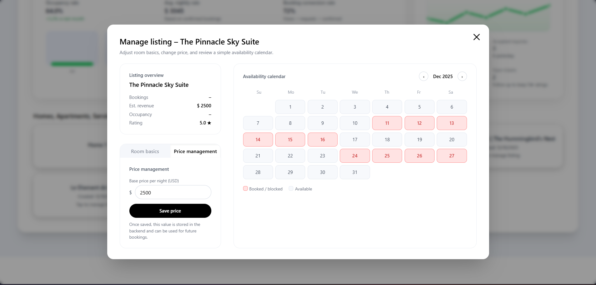


**Profile + Past Bookings**
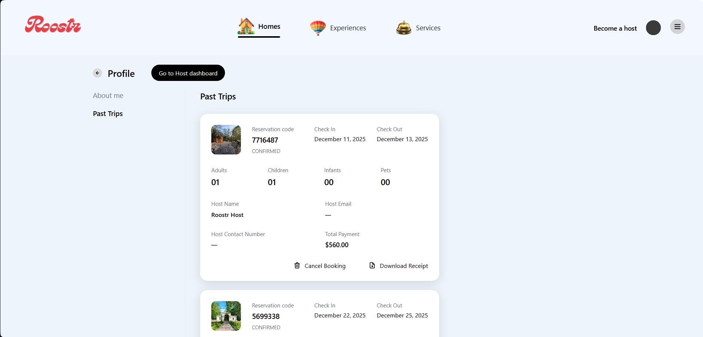

**Sign up & Signin**

**Menu & Logout**
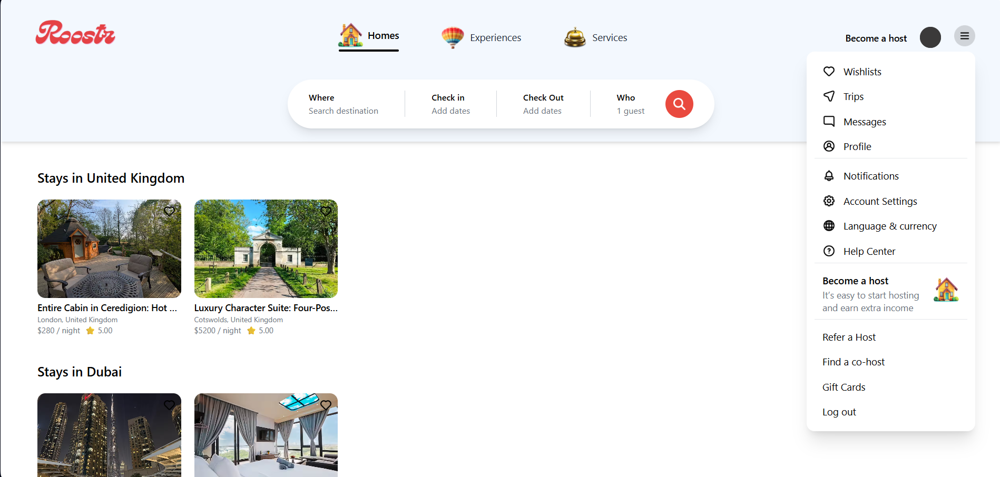
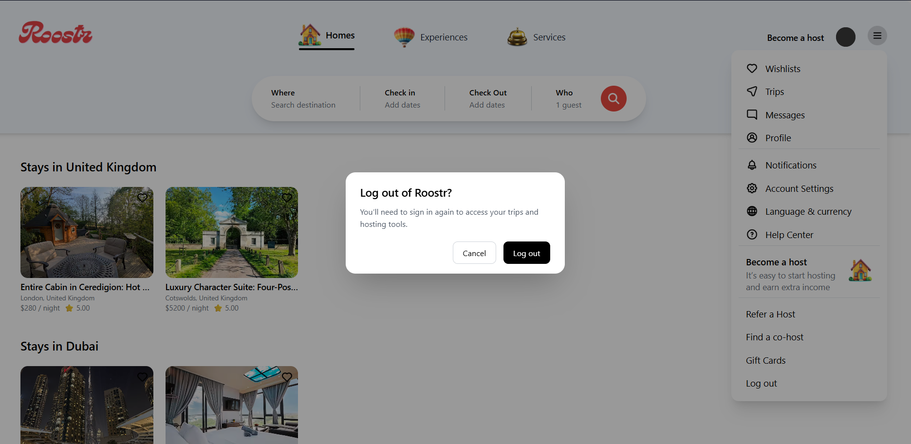


## 🔮 Future Improvements

-Integrate a real payment gateway (Stripe / PayPal).
-Add full review system stored in the database.
-Booking history pages for both guests and hosts.
-Map view with geolocation for listings.
-Email notifications for booking confirmation & cancellation.
-Multi-language support and currency conversion.

##👨‍💻 About the Developer
-Name: Sithum Buddhika Jayalal
-Role: Full-stack Developer / Software Engineering Undergraduate
-Institute: Sri Lanka Institute of Information Technology (SLIIT) – 3rd year


## 📬 Contact

- Email: [officialsithumbuddhika@gmail.com](mailto:officialsithumbuddhika@gmail.com)  
- LinkedIn: [Sithum Buddhika Jayalal](https://www.linkedin.com/in/sithum-buddhika-jayalal-827860341)


  
